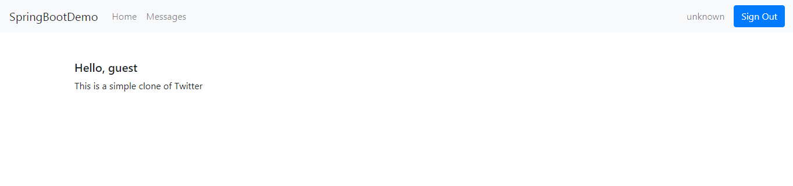
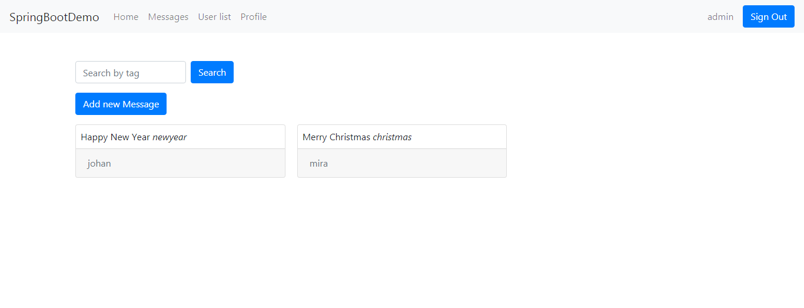

# SpringBootDemo
SpringBoot app (+JPA, MVC, Mail, Security, UI). Lesson from Youtube Channel "letsCode" 

Экран приветствия

Логин

Главная страница. Отображение сообщений от разных пользователей с возможностью поиска по тегам.

При добавлении нового сообщения открывается панель с полями и возможность добавить картинку.

У админа есть возможность просмотреть список пользователей (вкладка User list)

У админа есть возможность изменить роль пользователя (User/Admin)

Создание нового пользователя (регистрация)

На указанную при регистрации почту приходит письмо подтверждения

Страница подтверждения успешной регистрации

Страница редактирования профиля. Можно изменить пароль и ввести свою почту. На почту придет письмо потверждения изменения пароля

